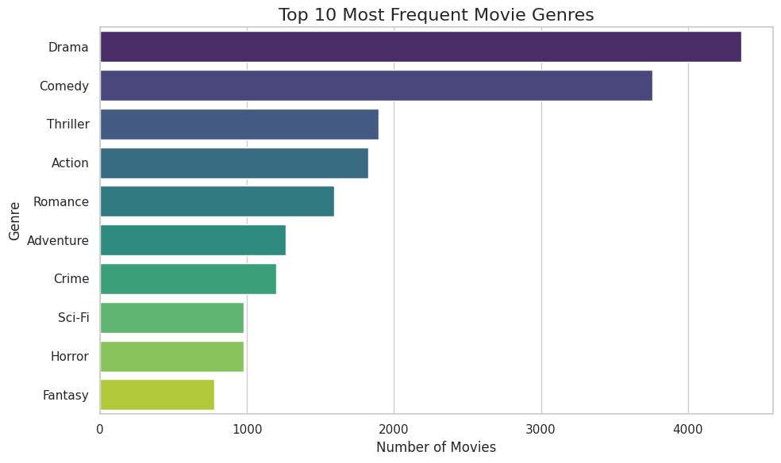
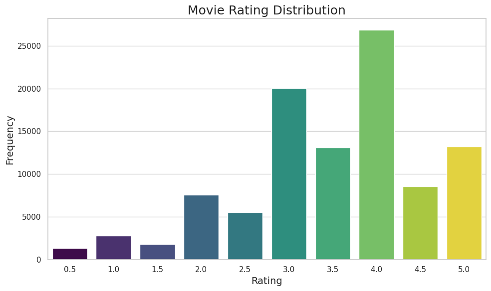
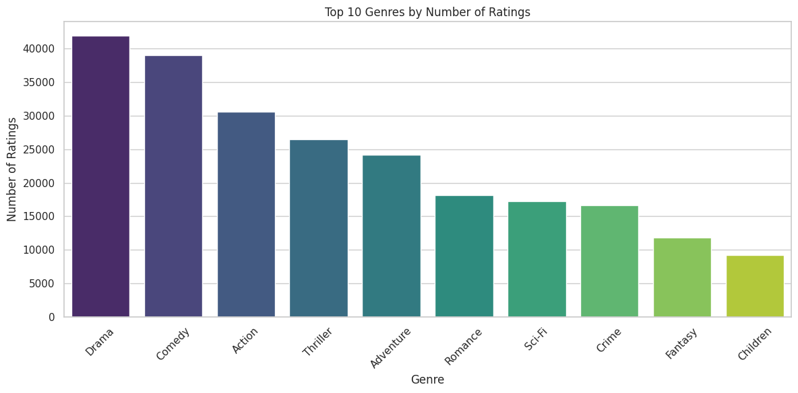
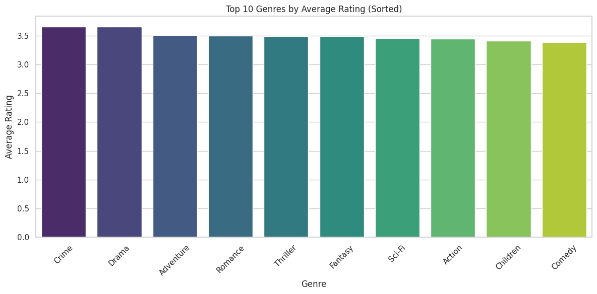
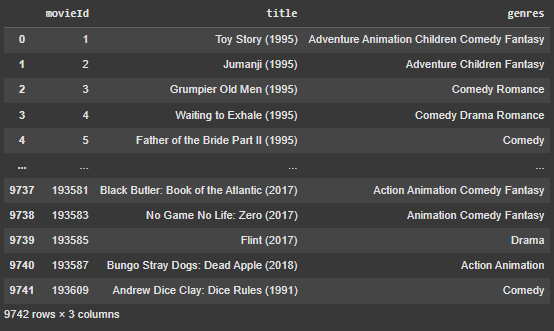

# Laporan Proyek Machine Learning Terapan - Felix Rafael
## Project Overview
Dalam era digital yang terus berkembang pesat, volume data yang dihasilkan manusia meningkat secara eksponensial setiap harinya, termasuk dalam industri hiburan seperti film. Layanan streaming seperti Netflix, Disney+, Amazon Prime Video, dan lainnya kini menyediakan ribuan hingga puluhan ribu judul yang dapat diakses kapan saja oleh pengguna dari berbagai belahan dunia. Ketersediaan konten yang sangat melimpah ini, meskipun menawarkan banyak pilihan, justru sering kali membuat pengguna mengalami kesulitan dalam menentukan tontonan yang sesuai dengan minat dan preferensi mereka. Untuk itu, sistem rekomendasi (Recommendation System) menjadi alat penting dalam meningkatkan pengalaman pengguna, dengan menyarankan konten yang relevan secara personal.

Netflix, sebagai pelopor dalam penerapan sistem rekomendasi, melaporkan bahwa sekitar 75% aktivitas menonton penggunanya didorong oleh sistem rekomendasi mereka. Menurut **[Gomez (2013)](https://www.wired.com/2013/08/qq-netflix-algorithm)**, sistem ini menganalisis metadata dan perilaku pengguna, termasuk apa yang telah ditonton, dicari, dan dinilai, serta mempertimbangkan faktor-faktor seperti waktu, perangkat, dan lokasi pengguna. Pendekatan ini menunjukkan betapa pentingnya rekomendasi dalam menjaga loyalitas pengguna dan meningkatkan keterlibatan mereka dengan platform. Namun, sistem rekomendasi yang baik memerlukan pendekatan cerdas, seperti pemanfaatan data histori tontonan, ulasan pengguna, hingga fitur berbasis konten seperti genre dan sinopsis film.

Salah satu pendekatan populer dalam membangun sistem rekomendasi adalah _Collaborative Filtering_, yang bekerja berdasarkan kesamaan antar pengguna atau antar item. Namun, pendekatan ini memiliki tantangan seperti _cold start problem_ ketika pengguna atau item baru tidak memiliki cukup data. Untuk mengatasi hal ini, pendekatan _Content-Based Filtering_ dan _Hybrid Models_ dikembangkan guna menggabungkan kekuatan kedua metode. Dalam _Recommender Systems Handbook_, **[Ricci et al. (2015)](https://link.springer.com/book/10.1007/978-1-4899-7637-6)** menjelaskan bahwa sistem rekomendasi berbasis konten memanfaatkan informasi deskriptif dari item, seperti genre dan sinopsis, untuk memberikan rekomendasi yang lebih akurat. 

Dengan berkembangnya teknik pembelajaran mesin dan pemrosesan bahasa alami (Natural Language Processing), sistem rekomendasi dapat dibangun lebih cerdas dan kontekstual. Model seperti _Neural Collaborative Filtering_ (NCF) telah diperkenalkan untuk mengatasi keterbatasan model tradisional dengan memanfaatkan arsitektur jaringan saraf dalam memodelkan interaksi kompleks antara pengguna dan item. **[He et al. (2017)](https://doi.org/10.48550/arXiv.1708.05031)** menunjukkan bahwa pendekatan ini mampu meningkatkan akurasi rekomendasi dengan mempelajari fungsi interaksi yang lebih kompleks dibandingkan dengan metode faktor matriks tradisional.

Proyek ini bertujuan untuk membangun sistem rekomendasi film yang andal dan efisien dengan menggunakan dua pendekatan berbeda, yaitu _Content-Based Filtering_ dan _Collaborative Filtering_. Dengan menggabungkan kedua pendekatan ini, proyek ini tidak hanya berfokus pada konten film itu sendiri, tetapi juga pada perilaku pengguna, sehingga menghasilkan sistem rekomendasi yang lebih adaptif, akurat, dan personal. Sistem ini diharapkan dapat membantu pengguna menemukan film yang sesuai dengan minat mereka secara cepat dan efisien, serta memberikan nilai tambah bagi pengembang aplikasi hiburan digital melalui peningkatan keterlibatan dan retensi pengguna.

## Business Understanding
### Problem Statements
Masalah-masalah utama yang diidentifikasi dalam konteks ini meliputi:
- Terjadinya _overload_ informasi di mana pengguna dihadapkan pada terlalu banyak pilihan sehingga kesulitan menentukan film mana yang paling sesuai dengan minat mereka.
- Kurangnya rekomendasi yang bersifat personal, dapat dilihat dari banyaknya sistem pencarian hanya berdasarkan kategori umum atau popularitas, yang mana belum tentu relevan bagi setiap individu. 
- Adanya masalah _cold start_, yaitu sistem rekomendasi sering kali kesulitan memberikan hasil yang akurat untuk pengguna baru (yang belum memiliki riwayat interaksi) atau film baru (yang belum pernah dinilai).

### Goals
Proyek ini bertujuan untuk membangun sistem rekomendasi film sebagai berikut:
- Mengurangi beban pengguna dalam memilih tontonan dengan menyaring film yang sesuai secara otomatis baik itu berdasarkan genre ataupun _rating_ pengguna lain.
- Dapat memberikan rekomendasi yang relevan dan personal bagi setiap pengguna, serta akurat, efisien, dan dapat diskalakan untuk berbagai jenis pengguna.
- Mengatasi masalah _cold start_, baik dari sisi pengguna maupun _item_, dengan menggabungkan pendekatan berbasis konten dan interaksi.

### Solution Statement
Untuk mencapai tujuan di atas, proyek ini mengadopsi dua pendekatan utama dalam pengembangan sistem rekomendasi, yaitu:
1. **`Content-Based Filtering`**:
Pendekatan ini merekomendasikan film kepada pengguna berdasarkan kemiripan antara _item_, bukan antar pengguna. Sistem ini:
    - Menggunakan _Natural Language Processing_ (NLP) untuk mengekstraksi fitur dari deskripsi film.
    - Menerapkan teknik _TF-IDF_ (Term Frequency-Inverse Document Frequency) untuk merepresentasikan genre film dalam bentuk vektor.
    - Menghitung _cosine similarity_ antar vektor deskripsi untuk mengidentifikasi film yang mirip dengan yang pernah disukai pengguna.
    - Cocok untuk mengatasi _cold start_ pada film baru, karena hanya bergantung pada metadata film, bukan histori interaksi pengguna.

2. **`Collaborative Filtering`**:
Pendekatan ini merekomendasikan film berdasarkan pola interaksi antar pengguna dan _item_. Sistem ini:
    - Menggunakan arsitektur _Neural Collaborative Filtering_ (NCF) dan _RecommenderNet_ yang memodelkan interaksi pengguna-item dengan jaringan saraf.
    - Menggeneralisasi teknik _matrix factorization_ melalui pembelajaran fitur laten pengguna dan item menggunakan _embedding layers_.
    - Memungkinkan pemodelan interaksi non-linear yang lebih kompleks dan akurat daripada _collaborative filtering tradisional_.
    - Efektif dalam menangkap preferensi implisit pengguna dari data interaksi, seperti _rating_.

## Data Understanding
Dataset yang digunakan dalam proyek ini diperoleh dari platform Kaggle dengan judul **`MovieLens Small Latest Dataset`**. Dataset ini merekam aktivitas _rating_ berbasis skala 5 bintang oleh pengguna terhadap film, yang dikumpulkan dari layanan rekomendasi film MovieLens. Dataset ini mencakup 100.836 rating pada 9.742 film, diberikan oleh 610 pengguna yang telah menilai minimal 20 film, dalam rentang waktu dari 29 Maret 1996 hingga 24 September 2018.

 Dataset ini terdiri dari empat file utama, yaitu: 
 - **`movies.csv`** yang berisi metadata film seperti judul dan genre.
 - **`ratings.csv`** yang mencatat _rating_ yang diberikan pengguna terhadap film.
 - **`tags.csv`** yang menyimpan tag atau label bebas yang ditambahkan pengguna untuk film tertentu. 
 - **`links.csv`** yang menyediakan referensi ID film ke database eksternal seperti IMDb dan TMDb. 

Meskipun dataset menyediakan beragam informasi, dalam proyek ini hanya dua file yang digunakan, yaitu movies.csv dan ratings.csv, karena keduanya merupakan komponen utama dalam membangun sistem rekomendasi berbasis konten dan perilaku pengguna.

File movies.csv terdiri dari 9.742 baris dan 3 kolom, sementara ratings.csv memuat 100.836 baris dan 4 kolom. Berdasarkan hasil pemeriksaan awal, tidak ditemukan adanya nilai kosong (missing values) maupun data duplikat di kedua file tersebut, sehingga data dapat langsung digunakan dalam proses analisis dan pembangunan model tanpa perlu dilakukan pembersihan tambahan.

Link Dataset: https://www.kaggle.com/datasets/shubhammehta21/movie-lens-small-latest-dataset

### Variabel-variabel pada movies.csv sebagai berikut:
- **`movieId`** (Integer): ID unik untuk setiap film. Digunakan untuk menghubungkan dengan file lainnya seperti ratings.csv.
- **`title`** (String): Judul lengkap film, biasanya disertai dengan tahun rilis dalam tanda kurung.
- **`genres`** (String): Daftar genre yang dimiliki oleh film, dipisahkan dengan simbol pipe (|).

### Variabel-variabel pada ratings.csv sebagai berikut:
- **`userId`** (Integer): ID unik untuk setiap pengguna.
- **`movieId`** (Integer): ID film yang dirating oleh pengguna, digunakan sebagai foreign key untuk menghubungkan ke movies.csv.
- **`rating`** (Float): Nilai _rating_ yang diberikan pengguna untuk film, dalam rentang 0.5 sampai 5.0, dengan interval 0.5.
- **`timestamp`** (Integer): Waktu ketika _rating_ diberikan, dalam format UNIX timestamp.

### Visualisasi Genre Film Terpopuler berdasarkan Jumlah Film

Visualisasi tersebut menampilkan 10 genre film paling sering muncul dalam dataset. Genre Drama menempati urutan pertama sebagai genre dengan jumlah film terbanyak, yaitu sekitar 4.400 judul. Di posisi kedua, terdapat genre _Comedy_ dengan total hampir 3.800 film.
Genre _Thriller_ dan _Action_ juga menunjukkan popularitas yang tinggi dengan masing-masing hampir 1.900 film. Selanjutnya, genre _Romance_ tercatat memiliki sekitar 1.600 film, diikuti oleh _Adventure_ dan _Crime_ yang memiliki jumlah film yang hampir seimbang, yakni di atas 1.200 judul. Tiga genre dengan jumlah film paling sedikit dalam daftar sepuluh besar ini adalah _Sci-Fi_, _Horror_, dan _Fantasy_, dengan total film masing-masing berada di bawah 1.000 judul. Visualisasi ini memberikan gambaran bahwa Drama dan Komedi merupakan genre yang paling dominan dalam industri perfilman menurut data yang tersedia, sementara genre _Fantasy_ menjadi yang paling jarang muncul di antara sepuluh genre teratas.

### Visualisasi Distribusi Rating Film

Visualisasi tersebut menampilkan distribusi nilai _rating_ film dalam bentuk histogram. Pada sumbu horizontal ditampilkan nilai _rating_ mulai dari 0.5 hingga 5.0 dengan interval 0.5, sementara sumbu vertikal merepresentasikan frekuensi atau jumlah film yang memperoleh _rating_ tersebut. Dari distribusi ini terlihat bahwa mayoritas film mendapatkan _rating_ di kisaran 3.0 hingga 4.0, dengan puncak distribusi berada pada _rating_ 4.0 yang mencapai frekuensi tertinggi sekitar 26.000 film. _Rating_ 3.0 juga cukup umum dengan total sekitar 20.000 film, diikuti oleh _rating_ 3.5 dan 5.0 yang masing-masing memiliki frekuensi sekitar 13.000 film. Sementara itu, _rating_ rendah seperti 0.5 hingga 1.5 hanya diberikan pada sedikit film, dengan jumlah masing-masing kurang dari 3.000 film. Distribusi ini menunjukkan pola _positively skewed_ (condong ke kanan), yang mengindikasikan bahwa sebagian besar film mendapatkan penilaian yang cukup baik hingga sangat baik, dan hanya sebagian kecil yang memperoleh penilaian sangat rendah.

### Visualisasi Genre Film Terpopuler berdasarkan Jumlah Rating

Grafik batang vertikal berikut menggambarkan 10 genre film dengan jumlah _rating_ terbanyak dalam dataset. Genre Drama menempati posisi teratas dengan lebih dari 41.000 _rating_, diikuti oleh _Comedy_ yang memperoleh sekitar 39.000 _rating_. Kedua genre ini menunjukkan tingkat keterlibatan pengguna yang sangat tinggi dalam memberikan penilaian. Genre _Action_ dan _Thriller_ menyusul di posisi berikutnya, masing-masing mendapatkan sekitar 30.000 dan 26.000 _rating_, menandakan bahwa film bergenre aksi dan ketegangan juga sangat diminati oleh pengguna. Sementara itu, genre _Adventure_ dan _Romance_ menerima jumlah _rating_ yang cukup signifikan, masing-masing sekitar 24.000 dan 18.000 rating. Lima genre dengan jumlah _rating_ terendah dalam daftar ini adalah _Sci-Fi_, _Crime_, _Fantasy_, dan _Children_, dengan genre _Children_ menjadi yang paling sedikit mendapatkan penilaian, yaitu kurang dari 10.000 _rating_. Secara keseluruhan, visualisasi ini mengindikasikan bahwa genre-genre populer seperti Drama, Komedi, dan Aksi tidak hanya mendominasi dalam jumlah produksi, tetapi juga menarik perhatian besar dari penonton. Sebaliknya, genre seperti Fantasi dan Anak-anak relatif memiliki tingkat partisipasi pengguna yang lebih rendah dalam memberikan _rating_.

### Visualisasi  Genre Film Terpopuler berdasarkan Rata-rata Rating

Visualisasi berikut menyajikan grafik batang horizontal yang menggambarkan 10 genre film dengan rata-rata _rating_ tertinggi, yang telah diurutkan dari nilai tertinggi ke terendah. Genre _Crime_ menempati posisi teratas dengan rata-rata rating sekitar 3.65, sedikit unggul dari genre Drama yang memperoleh nilai rata-rata serupa. Selanjutnya, genre _Adventure_, _Romance_, dan _Thriller_ masing-masing memiliki rata-rata _rating_ sekitar 3.5, menunjukkan bahwa film-film dengan genre tersebut cenderung mendapatkan respons positif dari penonton. Di tengah daftar, terdapat genre _Fantasy_, _Sci-Fi_, dan _Action_, yang masih mencatatkan performa baik berdasarkan penilaian pengguna. Sementara itu, dua genre yang menempati posisi terbawah dalam daftar ini adalah _Children_ dan _Comedy_, dengan rata-rata rating mendekati 3.4. Meskipun genre _Comedy_ tergolong sangat populer dari sisi jumlah produksi dan penonton, namun persepsi kualitasnya berdasarkan _rating_ sedikit lebih rendah dibandingkan genre lainnya.

## Data Preparation
### **1. Content Based Filtering**
Berikut ini adalah beberapa tahap yang dilakukan pada pendekatan _Content Based Filtering_ sebagai berikut:
-  **`Konversi Format Genre`**: Pada tahap ini, kolom genres yang awalnya berisi daftar genre diubah menjadi string dengan elemen yang dipisahkan spasi. Hal ini dilakukan bertujuan untuk genre bisa dianalisis sebagai fitur teks menggunakan teknik seperti _TF-IDF_. Proses ini termasuk dalam normalisasi teks yang bertujuan sebagai ekstraksi fitur teks untuk membuat data dalam bentuk teks yang terstruktur dan mudah diproses.
    ```python
    # Convert the 'genres' column from list back to space-separated string
    movies['genres'] = movies['genres'].apply(lambda x: ' '.join(x) if isinstance(x, list) else x)
    ```
    
-  **`Membuat Salinan Data`**: Pada tahap ini, data asli akan disalin ke variabel baru untuk diproses lebih lanjut. Tujuannya adalah menjaga data asli tetap utuh dan memungkinkan eksplorasi data secara aman. Hal ini bertujuan menduplikasi data untuk preprocessing yang aman.
    ```python
    # Create a copy of movies dataframe for preprocessing
    movie_pre = movies.copy()
    ```

-  **`Menghapus Genre Tidak Tersedia`**: Berikutnya, nilai _placeholder_ seperti "(no genres listed)" diganti dengan string kosong agar tidak mengganggu analisis. Tujuannya adalah menghilangkan data yang tidak mengandung informasi berguna. Hal ini termasuk dalam penghapusan data noise karena _placeholder_ tersebut tidak memberikan kontribusi dalam pemodelan sehingga harus dibersihkan.
    ```python
    # Replace '(no genres listed)' with an empty string
    movie_pre['genres'] = movie_pre['genres'].replace('(no genres listed)', '')
    ```

-  **`Menghapus Simbol Pemisah`**: Langkah terakhir, karakter pemisah | yang ada di string genre diganti dengan spasi. Alasannya adalah untuk memudahkan proses pemisahan kata sehingga setiap genre dapat dikenali secara terpisah. Hal ini karena _TF-IDF_ membutuhkan _input_ berupa teks biasa tanpa simbol khusus agar fitur dapat diekstrak dengan benar.
    ```python
    # Replace pipe '|' characters with space in the genres string
    movie_pre['genres'] = movie_pre['genres'].str.replace('|', ' ')
    ```    
Berikut adalah hasil dari tahap Data Preparation yang telah dilakukan pada pendekatan _Content Based Filtering_:

