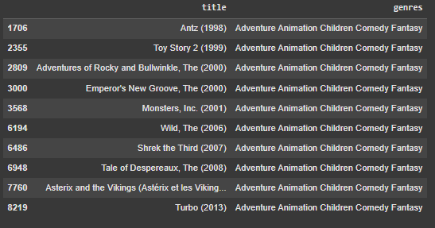
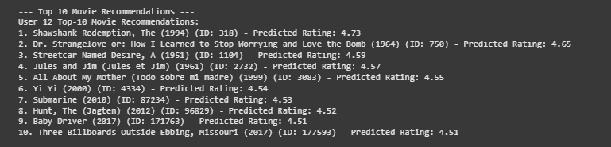
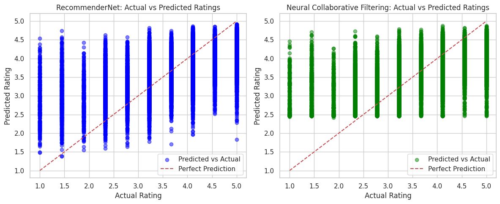

# Laporan Proyek Machine Learning Terapan - Felix Rafael
## Project Overview
Dalam era digital yang terus berkembang pesat, volume data yang dihasilkan manusia meningkat secara eksponensial setiap harinya, termasuk dalam industri hiburan seperti film. Layanan streaming seperti Netflix, Disney+, Amazon Prime Video, dan lainnya kini menyediakan ribuan hingga puluhan ribu judul yang dapat diakses kapan saja oleh pengguna dari berbagai belahan dunia. Ketersediaan konten yang sangat melimpah ini, meskipun menawarkan banyak pilihan, justru sering kali membuat pengguna mengalami kesulitan dalam menentukan tontonan yang sesuai dengan minat dan preferensi mereka. Untuk itu, sistem rekomendasi (Recommendation System) menjadi alat penting dalam meningkatkan pengalaman pengguna, dengan menyarankan konten yang relevan secara personal.

Netflix, sebagai pelopor dalam penerapan sistem rekomendasi, melaporkan bahwa sekitar 75% aktivitas menonton penggunanya didorong oleh sistem rekomendasi mereka. Menurut **[Gomez (2013)](https://www.wired.com/2013/08/qq-netflix-algorithm)**, sistem ini menganalisis metadata dan perilaku pengguna, termasuk apa yang telah ditonton, dicari, dan dinilai, serta mempertimbangkan faktor-faktor seperti waktu, perangkat, dan lokasi pengguna. Pendekatan ini menunjukkan betapa pentingnya rekomendasi dalam menjaga loyalitas pengguna dan meningkatkan keterlibatan mereka dengan platform. Namun, sistem rekomendasi yang baik memerlukan pendekatan cerdas, seperti pemanfaatan data histori tontonan, ulasan pengguna, hingga fitur berbasis konten seperti genre dan sinopsis film.

Salah satu pendekatan populer dalam membangun sistem rekomendasi adalah _Collaborative Filtering_, yang bekerja berdasarkan kesamaan antar pengguna atau antar item. Namun, pendekatan ini memiliki tantangan seperti _cold start problem_ ketika pengguna atau item baru tidak memiliki cukup data. Untuk mengatasi hal ini, pendekatan _Content-Based Filtering_ dan _Hybrid Models_ dikembangkan guna menggabungkan kekuatan kedua metode. Dalam _Recommender Systems Handbook_, **[Ricci et al. (2015)](https://link.springer.com/book/10.1007/978-1-4899-7637-6)** menjelaskan bahwa sistem rekomendasi berbasis konten memanfaatkan informasi deskriptif dari item, seperti genre dan sinopsis, untuk memberikan rekomendasi yang lebih akurat. 

Dengan berkembangnya teknik pembelajaran mesin dan pemrosesan bahasa alami (Natural Language Processing), sistem rekomendasi dapat dibangun lebih cerdas dan kontekstual. Model seperti _Neural Collaborative Filtering_ (NCF) telah diperkenalkan untuk mengatasi keterbatasan model tradisional dengan memanfaatkan arsitektur jaringan saraf dalam memodelkan interaksi kompleks antara pengguna dan item. **[He et al. (2017)](https://doi.org/10.48550/arXiv.1708.05031)** menunjukkan bahwa pendekatan ini mampu meningkatkan akurasi rekomendasi dengan mempelajari fungsi interaksi yang lebih kompleks dibandingkan dengan metode faktor matriks tradisional.

Proyek ini bertujuan untuk membangun sistem rekomendasi film yang andal dan efisien dengan menggunakan dua pendekatan berbeda, yaitu _Content-Based Filtering_ dan _Collaborative Filtering_. Dengan menggabungkan kedua pendekatan ini, proyek ini tidak hanya berfokus pada konten film itu sendiri, tetapi juga pada perilaku pengguna, sehingga menghasilkan sistem rekomendasi yang lebih adaptif, akurat, dan personal. Sistem ini diharapkan dapat membantu pengguna menemukan film yang sesuai dengan minat mereka secara cepat dan efisien, serta memberikan nilai tambah bagi pengembang aplikasi hiburan digital melalui peningkatan keterlibatan dan retensi pengguna.

## Business Understanding
### Problem Statements
Masalah-masalah utama yang diidentifikasi dalam konteks ini meliputi:
- Terjadinya _overload_ informasi di mana pengguna dihadapkan pada terlalu banyak pilihan sehingga kesulitan menentukan film mana yang paling sesuai dengan minat mereka.
- Kurangnya rekomendasi yang bersifat personal, dapat dilihat dari banyaknya sistem pencarian hanya berdasarkan kategori umum atau popularitas, yang mana belum tentu relevan bagi setiap individu. 
- Adanya masalah _cold start_, yaitu sistem rekomendasi sering kali kesulitan memberikan hasil yang akurat untuk pengguna baru (yang belum memiliki riwayat interaksi) atau film baru (yang belum pernah dinilai).

### Goals
Proyek ini bertujuan untuk membangun sistem rekomendasi film sebagai berikut:
- Mengurangi beban pengguna dalam memilih tontonan dengan menyaring film yang sesuai secara otomatis baik itu berdasarkan genre ataupun _rating_ pengguna lain.
- Dapat memberikan rekomendasi yang relevan dan personal bagi setiap pengguna, serta akurat, efisien, dan dapat diskalakan untuk berbagai jenis pengguna.
- Mengatasi masalah _cold start_, baik dari sisi pengguna maupun _item_, dengan menggabungkan pendekatan berbasis konten dan interaksi.

### Solution Statement
Untuk mencapai tujuan di atas, proyek ini mengadopsi dua pendekatan utama dalam pengembangan sistem rekomendasi, yaitu:
1. **`Content-Based Filtering`**:
Pendekatan ini merekomendasikan film kepada pengguna berdasarkan kemiripan antara _item_, bukan antar pengguna. Sistem ini:
    - Menggunakan _Natural Language Processing_ (NLP) untuk mengekstraksi fitur dari deskripsi film.
    - Menerapkan teknik _TF-IDF_ (Term Frequency-Inverse Document Frequency) untuk merepresentasikan genre film dalam bentuk vektor.
    - Menghitung _cosine similarity_ antar vektor deskripsi untuk mengidentifikasi film yang mirip dengan yang pernah disukai pengguna.
    - Cocok untuk mengatasi _cold start_ pada film baru, karena hanya bergantung pada metadata film, bukan histori interaksi pengguna.

2. **`Collaborative Filtering`**:
Pendekatan ini merekomendasikan film berdasarkan pola interaksi antar pengguna dan _item_. Sistem ini:
    - Menggunakan arsitektur _Neural Collaborative Filtering_ (NCF) dan _RecommenderNet_ yang memodelkan interaksi pengguna-item dengan jaringan saraf.
    - Menggeneralisasi teknik _matrix factorization_ melalui pembelajaran fitur laten pengguna dan item menggunakan _embedding layers_.
    - Memungkinkan pemodelan interaksi non-linear yang lebih kompleks dan akurat daripada _collaborative filtering tradisional_.
    - Efektif dalam menangkap preferensi implisit pengguna dari data interaksi, seperti _rating_.

## Data Understanding
Dataset yang digunakan dalam proyek ini diperoleh dari platform Kaggle dengan judul **`MovieLens Small Latest Dataset`**. Dataset ini merekam aktivitas _rating_ berbasis skala 5 bintang oleh pengguna terhadap film, yang dikumpulkan dari layanan rekomendasi film MovieLens. Dataset ini mencakup 100.836 rating pada 9.742 film, diberikan oleh 610 pengguna yang telah menilai minimal 20 film, dalam rentang waktu dari 29 Maret 1996 hingga 24 September 2018.

 Dataset ini terdiri dari empat file utama, yaitu: 
 - **`movies.csv`** yang berisi metadata film seperti judul dan genre.
 - **`ratings.csv`** yang mencatat _rating_ yang diberikan pengguna terhadap film.
 - **`tags.csv`** yang menyimpan tag atau label bebas yang ditambahkan pengguna untuk film tertentu. 
 - **`links.csv`** yang menyediakan referensi ID film ke database eksternal seperti IMDb dan TMDb. 

Meskipun dataset menyediakan beragam informasi, dalam proyek ini hanya dua file yang digunakan, yaitu movies.csv dan ratings.csv, karena keduanya merupakan komponen utama dalam membangun sistem rekomendasi berbasis konten dan perilaku pengguna.

File movies.csv terdiri dari 9.742 baris dan 3 kolom, sementara ratings.csv memuat 100.836 baris dan 4 kolom. Berdasarkan hasil pemeriksaan awal, tidak ditemukan adanya nilai kosong (missing values) maupun data duplikat di kedua file tersebut, sehingga data dapat langsung digunakan dalam proses analisis dan pembangunan model tanpa perlu dilakukan pembersihan tambahan.

Link Dataset: https://www.kaggle.com/datasets/shubhammehta21/movie-lens-small-latest-dataset

### Variabel-variabel pada movies.csv sebagai berikut:
- **`movieId`** (Integer): ID unik untuk setiap film. Digunakan untuk menghubungkan dengan file lainnya seperti ratings.csv.
- **`title`** (String): Judul lengkap film, biasanya disertai dengan tahun rilis dalam tanda kurung.
- **`genres`** (String): Daftar genre yang dimiliki oleh film, dipisahkan dengan simbol pipe (|).

### Variabel-variabel pada ratings.csv sebagai berikut:
- **`userId`** (Integer): ID unik untuk setiap pengguna.
- **`movieId`** (Integer): ID film yang dirating oleh pengguna, digunakan sebagai foreign key untuk menghubungkan ke movies.csv.
- **`rating`** (Float): Nilai _rating_ yang diberikan pengguna untuk film, dalam rentang 0.5 sampai 5.0, dengan interval 0.5.
- **`timestamp`** (Integer): Waktu ketika _rating_ diberikan, dalam format UNIX timestamp.

### Visualisasi Genre Film Terpopuler berdasarkan Jumlah Film

Visualisasi tersebut menampilkan 10 genre film paling sering muncul dalam dataset. Genre Drama menempati urutan pertama sebagai genre dengan jumlah film terbanyak, yaitu sekitar 4.400 judul. Di posisi kedua, terdapat genre _Comedy_ dengan total hampir 3.800 film.
Genre _Thriller_ dan _Action_ juga menunjukkan popularitas yang tinggi dengan masing-masing hampir 1.900 film. Selanjutnya, genre _Romance_ tercatat memiliki sekitar 1.600 film, diikuti oleh _Adventure_ dan _Crime_ yang memiliki jumlah film yang hampir seimbang, yakni di atas 1.200 judul. Tiga genre dengan jumlah film paling sedikit dalam daftar sepuluh besar ini adalah _Sci-Fi_, _Horror_, dan _Fantasy_, dengan total film masing-masing berada di bawah 1.000 judul. Visualisasi ini memberikan gambaran bahwa Drama dan Komedi merupakan genre yang paling dominan dalam industri perfilman menurut data yang tersedia, sementara genre _Fantasy_ menjadi yang paling jarang muncul di antara sepuluh genre teratas.

### Visualisasi Distribusi Rating Film

Visualisasi tersebut menampilkan distribusi nilai _rating_ film dalam bentuk histogram. Pada sumbu horizontal ditampilkan nilai _rating_ mulai dari 0.5 hingga 5.0 dengan interval 0.5, sementara sumbu vertikal merepresentasikan frekuensi atau jumlah film yang memperoleh _rating_ tersebut. Dari distribusi ini terlihat bahwa mayoritas film mendapatkan _rating_ di kisaran 3.0 hingga 4.0, dengan puncak distribusi berada pada _rating_ 4.0 yang mencapai frekuensi tertinggi sekitar 26.000 film. _Rating_ 3.0 juga cukup umum dengan total sekitar 20.000 film, diikuti oleh _rating_ 3.5 dan 5.0 yang masing-masing memiliki frekuensi sekitar 13.000 film. Sementara itu, _rating_ rendah seperti 0.5 hingga 1.5 hanya diberikan pada sedikit film, dengan jumlah masing-masing kurang dari 3.000 film. Distribusi ini menunjukkan pola _positively skewed_ (condong ke kanan), yang mengindikasikan bahwa sebagian besar film mendapatkan penilaian yang cukup baik hingga sangat baik, dan hanya sebagian kecil yang memperoleh penilaian sangat rendah.

### Visualisasi Genre Film Terpopuler berdasarkan Jumlah Rating

Grafik batang vertikal berikut menggambarkan 10 genre film dengan jumlah _rating_ terbanyak dalam dataset. Genre Drama menempati posisi teratas dengan lebih dari 41.000 _rating_, diikuti oleh _Comedy_ yang memperoleh sekitar 39.000 _rating_. Kedua genre ini menunjukkan tingkat keterlibatan pengguna yang sangat tinggi dalam memberikan penilaian. Genre _Action_ dan _Thriller_ menyusul di posisi berikutnya, masing-masing mendapatkan sekitar 30.000 dan 26.000 _rating_, menandakan bahwa film bergenre aksi dan ketegangan juga sangat diminati oleh pengguna. Sementara itu, genre _Adventure_ dan _Romance_ menerima jumlah _rating_ yang cukup signifikan, masing-masing sekitar 24.000 dan 18.000 rating. Lima genre dengan jumlah _rating_ terendah dalam daftar ini adalah _Sci-Fi_, _Crime_, _Fantasy_, dan _Children_, dengan genre _Children_ menjadi yang paling sedikit mendapatkan penilaian, yaitu kurang dari 10.000 _rating_. Secara keseluruhan, visualisasi ini mengindikasikan bahwa genre-genre populer seperti Drama, Komedi, dan Aksi tidak hanya mendominasi dalam jumlah produksi, tetapi juga menarik perhatian besar dari penonton. Sebaliknya, genre seperti Fantasi dan Anak-anak relatif memiliki tingkat partisipasi pengguna yang lebih rendah dalam memberikan _rating_.

### Visualisasi  Genre Film Terpopuler berdasarkan Rata-rata Rating

Visualisasi berikut menyajikan grafik batang horizontal yang menggambarkan 10 genre film dengan rata-rata _rating_ tertinggi, yang telah diurutkan dari nilai tertinggi ke terendah. Genre _Crime_ menempati posisi teratas dengan rata-rata rating sekitar 3.65, sedikit unggul dari genre Drama yang memperoleh nilai rata-rata serupa. Selanjutnya, genre _Adventure_, _Romance_, dan _Thriller_ masing-masing memiliki rata-rata _rating_ sekitar 3.5, menunjukkan bahwa film-film dengan genre tersebut cenderung mendapatkan respons positif dari penonton. Di tengah daftar, terdapat genre _Fantasy_, _Sci-Fi_, dan _Action_, yang masih mencatatkan performa baik berdasarkan penilaian pengguna. Sementara itu, dua genre yang menempati posisi terbawah dalam daftar ini adalah _Children_ dan _Comedy_, dengan rata-rata rating mendekati 3.4. Meskipun genre _Comedy_ tergolong sangat populer dari sisi jumlah produksi dan penonton, namun persepsi kualitasnya berdasarkan _rating_ sedikit lebih rendah dibandingkan genre lainnya.

## Data Preparation
### **1. Content Based Filtering**
Berikut ini adalah beberapa tahap yang dilakukan pada pendekatan _Content Based Filtering_ sebagai berikut:
-  **`Konversi Format Genre`**: Pada tahap ini, kolom genres yang awalnya berisi daftar genre diubah menjadi string dengan elemen yang dipisahkan spasi. Hal ini dilakukan bertujuan untuk genre bisa dianalisis sebagai fitur teks menggunakan teknik seperti _TF-IDF_. Proses ini termasuk dalam normalisasi teks yang bertujuan sebagai ekstraksi fitur teks untuk membuat data dalam bentuk teks yang terstruktur dan mudah diproses.
    ```python
    # Convert the 'genres' column from list back to space-separated string
    movies['genres'] = movies['genres'].apply(lambda x: ' '.join(x) if isinstance(x, list) else x)
    ```
    
-  **`Membuat Salinan Data`**: Pada tahap ini, data asli akan disalin ke variabel baru untuk diproses lebih lanjut. Tujuannya adalah menjaga data asli tetap utuh dan memungkinkan eksplorasi data secara aman. Hal ini bertujuan menduplikasi data untuk preprocessing yang aman.
    ```python
    # Create a copy of movies dataframe for preprocessing
    movie_pre = movies.copy()
    ```

-  **`Menghapus Genre Tidak Tersedia`**: Berikutnya, nilai _placeholder_ seperti "(no genres listed)" diganti dengan string kosong agar tidak mengganggu analisis. Tujuannya adalah menghilangkan data yang tidak mengandung informasi berguna. Hal ini termasuk dalam penghapusan data noise karena _placeholder_ tersebut tidak memberikan kontribusi dalam pemodelan sehingga harus dibersihkan.
    ```python
    # Replace '(no genres listed)' with an empty string
    movie_pre['genres'] = movie_pre['genres'].replace('(no genres listed)', '')
    ```

-  **`Menghapus Simbol Pemisah`**: Selanjutnya, karakter pemisah | yang ada di string genre diganti dengan spasi. Alasannya adalah untuk memudahkan proses pemisahan kata sehingga setiap genre dapat dikenali secara terpisah. Hal ini karena _TF-IDF_ membutuhkan _input_ berupa teks biasa tanpa simbol khusus agar fitur dapat diekstrak dengan benar.
    ```python
    # Replace pipe '|' characters with space in the genres string
    movie_pre['genres'] = movie_pre['genres'].str.replace('|', ' ')
    ```    

-  **`TF-IDF Vectorization`**: Langkah terakhir, TF-IDF mengubah teks genre menjadi fitur numerik yang menunjukkan seberapa penting setiap kata genre dalam dataset. Dengan cara ini, model bisa mengenali pola genre secara efektif tanpa terganggu oleh kata yang sering muncul tapi kurang informatif.
    ```python
    # Initialize TF-IDF vectorizer
    tfidf = TfidfVectorizer()
    # Fit and transform the 'genres' column to create a TF-IDF feature matrix
    tfidf_matrix = tfidf.fit_transform(movies['genres'])
    ```
Berikut adalah hasil dari tahap _Data Preparation_ yang telah dilakukan pada pendekatan _Content Based Filtering_:


### **2. Collaborative Filtering**
Berikut ini adalah beberapa tahap yang dilakukan pada pendekatan _Collaborative Filtering_ sebagai berikut:
-  **`Feature reduction`**: Pada tahap ini, kolom _timestamp_ dihapus dari data _rating_ karena informasi waktu tidak digunakan dalam proses pemodelan _Collaborative Filtering_. Alasannya adalah kolom _timestamp_ tidak memberikan kontribusi terhadap pembelajaran preferensi pengguna terhadap film dalam pendekatan _matrix factorization_ atau _neural collaborative filtering_ (NCF). Mengurangi dimensi data juga membantu menyederhanakan proses pelatihan model.
    ```python
    # Drop unnecessary columns: Timestamp
    ratings = ratings.drop(columns='timestamp')
    ratings.head()
    ```

-  **`Entity extraction`**: Berikutnya adalah mengambil daftar unik dari pengguna (userId) dan film (movieId) yang terdapat dalam dataset _rating_. Di mana kita mengidentifikasi entitas dasar yang terlibat dalam sistem rekomendasi, yaitu pengguna dan item (film). Alasan dilakukannya tahapan ini adalah karena _Collaborative Filtering_ memerlukan representasi eksplisit dari pengguna dan item dalam bentuk _embedding_. Dengan mengekstrak pengguna dan film unik, kita dapat menentukan ukuran dimensi _embedding_ serta memetakan setiap pengguna dan film ke dalam ID indeks numerik yang konsisten dalam proses pelatihan model.
    ```python
    # Extract the list of unique users from the ratings dataset
    unique_users = ratings['userId'].drop_duplicates().tolist()
    # Extract the list of unique movies from the ratings dataset
    unique_movies = ratings['movieId'].drop_duplicates().tolist()
    ```
    
-  **`Index encoding`**: Langkah ini bertujuan untuk mengubah userId dan movieId asli yang bersifat non-sekuensial menjadi indeks numerik berurutan yang dimulai dari nol. Proses ini penting karena model seperti NCF memerlukan input dalam bentuk indeks integer yang akan digunakan untuk _embedding lookups_. _Embedding layers_ dalam TensorFlow hanya menerima input berupa indeks numerik untuk memetakan ke vektor fitur laten. Oleh karena itu, pemetaan ini membantu menciptakan representasi yang efisien dan terstruktur untuk pengguna dan item, serta memastikan keselarasan antara data dan model selama pelatihan.
    ```python
    # Create dictionaries to map original userId and movieId to integer indices
    user_mapping = {user_id: idx for idx, user_id in enumerate(unique_users)}
    movie_mapping = {movie_id: idx for idx, movie_id in enumerate(unique_movies)}
    ```
    
-  **`Index transformation`**: Langkah ini bertujuan untuk membuat dua kolom baru, yaitu user_index dan movie_index, yang berisi representasi numerik dari masing-masing userId dan movieId. Alasan utama dilakukannya transformasi ini adalah karena model NCF tidak dapat langsung bekerja dengan ID asli yang tidak terstruktur atau terlalu besar rentangnya. Dengan memetakan ke indeks numerik, data menjadi kompatibel untuk dimasukkan ke dalam layer _embedding_ dalam model _Deep Learning_. Hal ini juga membantu menghemat memori dan mempercepat proses pelatihan, karena indeks ini akan digunakan sebagai referensi untuk mengambil representasi vektor dari pengguna dan film selama proses _forward pass_ pada model.
    ```python
   # Apply the mapping dictionaries to the ratings dataframe to create new columns with integer indices
    ratings['user_index'] = ratings['userId'].apply(lambda x: user_mapping[x])
    ratings['movie_index'] = ratings['movieId'].apply(lambda x: movie_mapping[x])
    ```    
    
-  **`Normalization`**: Langkah ini bertujuan untuk mengubah nilai _rating_ asli yang berada pada rentang 0.5 hingga 5.0 menjadi skala antara 0 hingga 1. Alasan dilakukan normalisasi adalah karena model _neural network_ lebih optimal ketika fitur _input_ berada dalam skala yang seragam. Tanpa normalisasi, nilai _rating_ yang besar bisa mendominasi pembelajaran dan menghambat konvergensi model. Dengan mengubah nilai _rating_ ke skala 0–1, model dapat mempelajari hubungan secara lebih stabil dan akurat antara pengguna dan film dalam proses _training_.
    ```python
   # Find the minimum and maximum rating values
    min_rating = ratings['rating'].min()
    max_rating = ratings['rating'].max()
    
    # Normalize the 'rating' column to a scale from 0 to 1
    def normalize_rating(r):
        return (r - min_rating) / (max_rating - min_rating)
    ratings['rating_normalized'] = ratings['rating'].map(normalize_rating)
    ```        

-  **`Data splitting and sampling`**: Langkah ini bertujuan untuk menyiapkan data masukan dan keluaran model serta membaginya menjadi data pelatihan dan data validasi. Dataset diacak terlebih dahulu agar distribusi data acak dan tidak bias berdasarkan urutan. Kemudian, _features_ (input) terdiri dari indeks pengguna dan indeks film, sedangkan _targets_ (output) adalah _rating_ yang telah dinormalisasi. Pembagian dilakukan dengan rasio 80% data pelatihan dan 20% data validasi, untuk memastikan model dapat dilatih secara efektif dan diuji pada data yang tidak pernah dilihat sebelumnya. Alasan dari pembagian ini adalah untuk mengevaluasi performa model pada data yang belum dikenal, sehingga kita bisa mendeteksi apakah model mengalami _overfitting_ atau generalisasi dengan baik terhadap data baru.
    ```python
   # Shuffle the dataset to ensure random distribution of samples
    shuffled_ratings = ratings.sample(frac=1, random_state=42).reset_index(drop=True)
    # Extract input features: user and movie indices
    features = shuffled_ratings[['user_index', 'movie_index']].to_numpy()
    # Extract target output: normalized ratings
    targets = shuffled_ratings['rating_normalized'].to_numpy()
    # Calculate the cutoff index for 80% training data
    train_cutoff = int(0.8 * len(shuffled_ratings))
    # Split data into training and validation sets
    X_train = features[:train_cutoff]
    X_val = features[train_cutoff:]
    y_train = targets[:train_cutoff]
    y_val = targets[train_cutoff:]
    ```        

## Modeling
Dalam tahap _modeling_, sistem rekomendasi dibangun untuk memberikan saran film yang relevan kepada pengguna. Proses ini dibagi menjadi dua pendekatan utama, yaitu _Content-Based Filtering_ dan _Collaborative Filtering_. Kedua pendekatan ini digunakan secara terpisah untuk membandingkan efektivitas dan karakteristik masing-masing dalam menghasilkan rekomendasi.
### **1. Content Based Filtering**
Model _Content-Based Filtering_ dibangun dengan menggunakan teknik _TF-IDF_ (Term Frequency-Inverse Document Frequency) untuk mengubah data genre film menjadi representasi numerik yang dapat dianalisis.
```python
# Calculate cosine similarity between all movie genre vectors
cosine_sim = cosine_similarity(tfidf_matrix, tfidf_matrix)
# Recommend movies similar to a given movie based on genre similarity
def recommend_movies(movie_title, movies=movies, cosine_sim=cosine_sim, top_n=10):
    # Find the index of the movie that matches the title
    idx = movies[movies['title'] == movie_title].index[0]
    # Get similarity scores for this movie with all others
    sim_scores = list(enumerate(cosine_sim[idx]))
    # Sort movies by similarity score in descending order, excluding the movie itself
    sim_scores = sorted(sim_scores, key=lambda x: x[1], reverse=True)[1:top_n+1]
    # Get the indices of the top N similar movies
    movie_indices = [i[0] for i in sim_scores]
    # Return the titles and genres of the recommended movies
    return movies.iloc[movie_indices][['title', 'genres']]
# Content-Based Movie Recommendation Testing
recommend_movies('Toy Story (1995)', top_n=10)
```
Pertama, kemiripan antar film dihitung menggunakan _cosine similarity_ berdasarkan matriks _TF-IDF_ tersebut, sehingga menghasilkan skor kesamaan antara setiap pasangan film. Sistem rekomendasi ini kemudian menggunakan skor kemiripan tersebut untuk menyarankan film yang memiliki genre paling mirip dengan film input yang diberikan pengguna. Fungsi _recommend_movies_ mengambil judul film sebagai _input_ dan mengembalikan daftar top-N film rekomendasi yang paling mirip berdasarkan genre. Sebagai contoh, ketika diberikan film Toy Story (1995), sistem akan menampilkan 10 film dengan genre yang paling mirip sebagai rekomendasi.



Pendekatan ini sangat efektif untuk memberikan rekomendasi yang sesuai dengan preferensi genre pengguna tanpa memerlukan data _rating_ atau interaksi pengguna lainnya. Salah satu keunggulan penting dari metode ini adalah kemampuannya mengatasi masalah _cold start_, yaitu ketika pengguna atau _item_ baru belum memiliki data interaksi yang cukup untuk sistem rekomendasi berbasis kolaboratif. Namun, kekurangannya adalah sistem ini kurang mampu menangani preferensi yang kompleks yang melibatkan pola interaksi antar pengguna, sehingga rekomendasi cenderung terbatas pada kemiripan konten saja.

### **2. Collaborative Filtering**
Pada pendekatan _Collaborative Filtering_, sistem rekomendasi dikembangkan berdasarkan pola interaksi antara pengguna dan _item_ (film), tanpa memperhatikan konten film itu sendiri. Untuk mengimplementasikan metode ini, kami menggunakan dua model algoritma berbeda, yaitu _RecommenderNet_, sebuah jaringan saraf sederhana berbasis _embedding_, dan _Neural Collaborative Filtering_ (NCF), yang menggabungkan pendekatan generalisasi linear dan non-linear untuk menangkap hubungan kompleks antara pengguna dan _item_. Pendekatan ini memungkinkan sistem menghasilkan rekomendasi yang lebih personal dan relevan berdasarkan kesamaan preferensi antar pengguna.
#### a. RecommenderNet
Model **RecommenderNet** adalah arsitektur *Neural Collaborative Filtering* sederhana yang memanfaatkan _embedding_ untuk merepresentasikan fitur laten pengguna dan film. Model ini bekerja dengan mengubah indeks pengguna dan film menjadi vektor representasi berdimensi rendah (latent factors) menggunakan lapisan _embedding_, lalu menghitung interaksi antara keduanya melalui perkalian elemen demi elemen (dot product). Selain embedding, model ini juga menyertakan _bias_ khusus untuk setiap pengguna dan film, serta menerapkan teknik _dropout_ guna mengurangi risiko _overfitting_. Keluaran dari model ini adalah nilai prediksi _rating_ yang telah dinormalisasi ke rentang 0–1 menggunakan fungsi aktivasi _sigmoid_. Pendekatan ini memungkinkan sistem belajar preferensi tersembunyi berdasarkan pola interaksi historis pengguna dan memberikan hasil rekomendasi yang lebih personal.
```python
class RecommenderNet(tf.keras.Model):
    def __init__(self, total_users, total_movies, embed_dim, **kwargs):
        super().__init__(**kwargs)
        self.total_users = total_users
        self.total_movies = total_movies
        self.embed_dim = embed_dim

        # User embedding and bias
        self.user_emb = layers.Embedding(
            input_dim=total_users,
            output_dim=embed_dim,
            embeddings_initializer='he_normal',
            embeddings_regularizer=regularizers.l2(1e-6)
        )
        self.user_bias_emb = layers.Embedding(total_users, 1)

        # Movie embedding and bias
        self.movie_emb = layers.Embedding(
            input_dim=total_movies,
            output_dim=embed_dim,
            embeddings_initializer='he_normal',
            embeddings_regularizer=regularizers.l2(1e-6)
        )
        self.movie_bias_emb = layers.Embedding(total_movies, 1)

         # Dropout for regularization
        self.dropout = layers.Dropout(0.2)

    def call(self, inputs, training=False):
        user_input = inputs[:, 0]
        movie_input = inputs[:, 1]

        user_vector = self.dropout(self.user_emb(user_input), training=training)
        user_bias = self.user_bias_emb(user_input)
        movie_vector = self.dropout(self.movie_emb(movie_input), training=training)
        movie_bias = self.movie_bias_emb(movie_input)

        interaction = tf.reduce_sum(user_vector * movie_vector, axis=1, keepdims=True)
        output = interaction + user_bias + movie_bias
        return tf.nn.sigmoid(output)
```     
Setelah arsitektur _RecommenderNet_ berhasil didefinisikan, langkah selanjutnya adalah menginisialisasi dan menyusun model tersebut untuk proses pelatihan. Model diinisialisasi dengan parameter jumlah total pengguna dan film dari data yang telah dipetakan, serta dimensi _embedding_ sebesar 6 sebagai representasi fitur _laten_. Model kemudian dikompilasi menggunakan _optimizer_ Adam dengan _learning rate_ sebesar 0.001 untuk mempercepat konvergensi. Sebagai fungsi _loss_, digunakan _Mean Squared Error_ (MSE) yang umum digunakan dalam masalah regresi. Selain itu, metrik evaluasi yang dipantau selama pelatihan adalah _Root Mean Squared Error_ (RMSE) yang memberikan gambaran yang lebih interpretatif terhadap kesalahan prediksi karena berada dalam skala yang sama dengan rating. Tahapan ini menjadi kunci dalam mempersiapkan model agar mampu mempelajari pola interaksi dari data pelatihan.
```python
# Initialize the RecommenderNet model
model = RecommenderNet(total_users=len(user_mapping), total_movies=len(movie_mapping), embed_dim=6)
# Compile the model
model.compile(
    optimizer=tf.keras.optimizers.Adam(learning_rate=0.001),
    loss='mean_squared_error',
    metrics=[tf.keras.metrics.RootMeanSquaredError()]
)
```
Untuk melatih model _RecommenderNet_, digunakan strategi pelatihan yang mencakup mekanisme _early stopping_ dan penyesuaian _learning rate_ secara adaptif untuk mengoptimalkan proses _training_. _Callback EarlyStopping_ diterapkan agar pelatihan otomatis dihentikan apabila _validation loss_ tidak menunjukkan peningkatan setelah 2 _epoch_ berturut-turut. Hal ini bertujuan untuk mencegah _overfitting_ dan menghemat waktu komputasi. Selain itu, diterapkan juga _callback ReduceLROnPlateau_ yang secara otomatis mengurangi _learning rate_ sebanyak setengah jika _validation loss_ stagnan selama 2 _epoch_. Hal ini membantu model mencapai konvergensi lebih halus dan stabil pada tahap akhir pelatihan. Model dilatih menggunakan _batch size_ sebesar 64 dan maksimum 25 _epoch_, dengan pembagian data menjadi 80% untuk pelatihan dan 20% untuk validasi. Selama proses pelatihan, metrik dan _loss_ dilacak untuk mengevaluasi kinerja model dalam mempelajari hubungan _laten_ antara pengguna dan film.
```python
# EarlyStopping callback to stop training when validation loss stops improving
early_stopping = tf.keras.callbacks.EarlyStopping(
    monitor='val_loss',
    patience=2,
    restore_best_weights=True
)
# ReduceLROnPlateau callback to reduce learning rate when validation loss plateaus
reduce_lr = tf.keras.callbacks.ReduceLROnPlateau(
    monitor='val_loss',
    factor=0.5,
    patience=2,
    verbose=1
)
# Training the RecommenderNet model
history_recommenderNet = model.fit(
    X_train, y_train,
    batch_size=64,
    epochs=25,
    verbose=1,
    validation_data=(X_val, y_val),
    callbacks=[early_stopping, reduce_lr]
)
```
Pendekatan _RecommenderNet_ menghasilkan rekomendasi berdasarkan pola interaksi historis antara pengguna dan film, dengan memanfaatkan pembelajaran representasi (embedding) untuk memodelkan faktor _laten_. Dalam implementasinya, setelah model dilatih, kita dapat memprediksi skor kesukaan pengguna terhadap semua film yang tersedia, kemudian memilih Top-N film dengan skor prediksi tertinggi untuk ditampilkan sebagai rekomendasi personal.
```python
# Function to get top-N movie recommendations for a given user using the trained model
def get_top_n_recommendations(model, user_id, movie_ids, movies_df, N=10):
    # Create an array where user_id repeats for each movie
    user_array = np.array([user_id] * len(movie_ids))
    # Stack user and movie indices to create input pairs for the model
    input_array = np.stack([user_array, movie_ids], axis=1)
    # Predict ratings for all movies for this user
    predictions = model.predict(input_array, verbose=0).flatten()
    # Get indices of top N predicted ratings, sorted descending
    top_indices = np.argsort(predictions)[::-1][:N]
    # Extract movie IDs and predicted scores for the top N movies
    top_movie_ids = movie_ids[top_indices]
    top_scores = predictions[top_indices]
    # Filter movies DataFrame to include only the top recommended movies
    top_movies = movies_df[movies_df['movieId'].isin(top_movie_ids)].copy()
    # Add predicted score (normalized 0-1)
    top_movies['predicted_score'] = top_movies['movieId'].map(dict(zip(top_movie_ids, top_scores)))
    # Convert predicted scores back to rating scale 1-5
    top_movies['predicted_rating'] = top_movies['predicted_score'] * 4 + 1
    # Sort movies by predicted rating descending and reset index for ranking
    top_movies = top_movies.sort_values(by='predicted_rating', ascending=False).reset_index(drop=True)
    top_movies.index += 1  # Start rank index at 1
    # Return movieId, title, and predicted_rating
    return top_movies[['movieId', 'title', 'predicted_rating']]
```
Fungsi `get_top_n_recommendations()` digunakan untuk menghasilkan daftar film terbaik bagi seorang pengguna tertentu (misalnya `user_id = 3`). Fungsi ini menyusun pasangan _input_ pengguna-film, melakukan prediksi terhadap seluruh film, lalu memilih film dengan skor tertinggi. Skor yang dihasilkan berada dalam rentang 0–1 dan kemudian dikonversi kembali ke skala _rating_ 1–5 untuk interpretasi yang lebih mudah. Hasil akhirnya adalah daftar rekomendasi film yang telah dipersonalisasi, lengkap dengan prediksi nilai rating yang akan diberikan oleh pengguna tersebut, yang sangat berguna untuk sistem seperti platform _streaming_ berbasis preferensi pengguna. 


Pendekatan _RecommenderNet_ ini memiliki kelebihan utama berupa kemampuannya dalam menangkap hubungan kompleks antara pengguna dan film melalui pembelajaran representasi fitur yang tidak eksplisit. Hal ini membuat _RecommenderNet_ efektif dalam memberikan rekomendasi yang lebih personal dan akurat, terutama ketika tersedia banyak data interaksi. Selain itu, penggunaan _dropout_ dan regularisasi juga membantu mencegah _overfitting_ serta meningkatkan generalisasi model. Namun, pendekatan ini memiliki kelemahan dalam menangani masalah _cold start_, karena membutuhkan data interaksi historis agar dapat menghasilkan prediksi yang baik. Jika terdapat pengguna atau film baru yang belum pernah muncul dalam data pelatihan, model ini tidak dapat memberikan rekomendasi yang efektif.

#### b. Neural Collaborative Filtering (NCF)
Pendekatan **Neural Collaborative Filtering (NCF)** memperluas ide dasar kolaboratif dengan memanfaatkan arsitektur _neural network_ yang lebih kompleks. Dalam model ini, representasi pengguna dan _item_ dipelajari melalui layer _embedding_, lalu dikombinasikan melalui proses _concatenation_ dan diproses oleh beberapa layer _dense_ yang dilengkapi dengan regularisasi L2, _batch normalization_, dan _dropout_. Tujuan utamanya adalah menangkap interaksi non-linear antara pengguna dan _item_ yang tidak dapat ditangkap oleh metode _matrix factorization_ tradisional. 
```python
num_users = len(user_mapping)
num_items = len(movie_mapping)
embedding_dim = 8
# Input layers
user_input = layers.Input(shape=(), dtype=tf.int32, name='user_input')
item_input = layers.Input(shape=(), dtype=tf.int32, name='item_input')

# Embedding layers with regularization
user_embedding = layers.Embedding(
    input_dim=num_users,
    output_dim=embedding_dim,
    embeddings_regularizer=regularizers.l2(1e-6),
    name='user_embedding'
)(user_input)

item_embedding = layers.Embedding(
    input_dim=num_items,
    output_dim=embedding_dim,
    embeddings_regularizer=regularizers.l2(1e-6),
    name='item_embedding'
)(item_input)

# Concatenate embedding
user_vec = layers.Flatten()(user_embedding)
item_vec = layers.Flatten()(item_embedding)
concat = layers.Concatenate()([user_vec, item_vec])

# Fully connected layers with dropout and L2 regularization
x = layers.Dense(64, activation='relu', kernel_regularizer=regularizers.l2(1e-6))(concat)
x = layers.BatchNormalization()(x)
x = layers.Activation('relu')(x)
x = layers.Dropout(0.2)(x)
x = layers.Dense(32, activation='relu', kernel_regularizer=regularizers.l2(1e-6))(x)

# Output layer
output = layers.Dense(1, activation='sigmoid')(x)

# Define model
model_ncf = Model(inputs=[user_input, item_input], outputs=output)
model_ncf.compile(
    optimizer=optimizers.Adam(learning_rate=0.001),
    loss='mse',
    metrics=[tf.keras.metrics.RootMeanSquaredError()]
)
```
Model _Neural Collaborative Filtering_ (NCF) dilatih menggunakan _input_ ganda berupa ID pengguna dan ID film yang telah dipisahkan dari dataset pelatihan dan validasi. Proses pelatihan dilakukan selama maksimum 30 epoch dengan ukuran _batch_ 64 dan pengacakan data setiap _epoch_ untuk menghindari _overfitting_ terhadap pola tertentu. Untuk meningkatkan stabilitas dan efisiensi pelatihan, digunakan dua _callback_, yaitu _EarlyStopping_ yang akan menghentikan pelatihan ketika metrik validasi tidak membaik selama dua _epoch_ berturut-turut, serta _ReduceLROnPlateau_, yang menurunkan laju pembelajaran saat metrik validasi stagnan. Selama pelatihan, model belajar merepresentasikan relasi non-linear antara pengguna dan film melalui beberapa layer _fully connected_, yang diperkaya dengan _dropout_ dan regularisasi.
```python
# Separate users and items for training and validation
X_train_user = X_train[:, 0]
X_train_item = X_train[:, 1]
X_val_user = X_val[:, 0]
X_val_item = X_val[:, 1]

# EarlyStopping callback to stop training when validation loss stops improving
early_stopping = tf.keras.callbacks.EarlyStopping(
    monitor='val_loss',
    patience=2,
    restore_best_weights=True
)
# ReduceLROnPlateau callback to reduce learning rate when validation loss plateaus
reduce_lr = tf.keras.callbacks.ReduceLROnPlateau(
    monitor='val_loss',
    factor=0.5,
    patience=2,
    verbose=1
)

# Training the Neural Collaborative Filtering model
history_ncf = model_ncf.fit(
    [X_train_user, X_train_item], y_train,
    validation_data=([X_val[:, 0], X_val[:, 1]], y_val),
    epochs=30,
    batch_size=64,
    shuffle=True,
    callbacks=[early_stopping, reduce_lr]
)
```
Fungsi `get_top_n_recommendations_ncf` digunakan untuk menghasilkan rekomendasi film teratas bagi pengguna tertentu berdasarkan prediksi _rating_ dari model _Neural Collaborative Filtering_ yang telah dilatih. Fungsi ini menerima ID pengguna, daftar indeks film, serta data film sebagai _input_, kemudian memprediksi _rating_ untuk semua film yang tersedia bagi pengguna tersebut. Prediksi _rating_ ini kemudian diurutkan dari yang tertinggi, dan diambil sejumlah N film teratas sebagai rekomendasi. Selanjutnya, hasil prediksi yang berupa nilai dalam rentang 0 hingga 1 dikonversi ke skala _rating_ 0 hingga 5 untuk memudahkan interpretasi. Film-film yang direkomendasikan ditampilkan dalam urutan rating prediksi tertinggi disertai informasi judul dan ID film. Berikut adalah contoh penerapan untuk `user_id = 12`.
```python
# Generate top-N movie recommendations for a given user using a trained NCF model.
def get_top_n_recommendations_ncf(model, user_id, movie_indices, movies_df, movie_mapping, N=10):
    # Create an array with the same user_id repeated for all movies
    user_array = np.array([user_id] * len(movie_indices))
    # Predict ratings using the NCF model
    predictions = model_ncf.predict([user_array, movie_indices], verbose=0).flatten()
    # Get indices of top-N highest predicted ratings
    top_indices = np.argsort(predictions)[::-1][:N]
    top_movie_indices = movie_indices[top_indices]
    top_scores = predictions[top_indices]
    # Map embedding indices back to original movie IDs
    index_to_movie = {idx: mid for mid, idx in movie_mapping.items()}
    top_movie_ids = [index_to_movie[idx] for idx in top_movie_indices]
    # Select movies from movies_df corresponding to top movie IDs
    top_movies = movies_df[movies_df['movieId'].isin(top_movie_ids)].copy()
    # Add columns for predicted score (0-1) and convert to rating scale 0-5
    top_movies['predicted_score'] = top_movies['movieId'].map(dict(zip(top_movie_ids, top_scores)))
    top_movies['predicted_rating'] = top_scores * 5.0
     # Sort movies by predicted_rating descending and reset index starting from 1
    top_movies = top_movies.sort_values(by='predicted_rating', ascending=False).reset_index(drop=True)
    top_movies.index += 1
    return top_movies[['movieId', 'title', 'predicted_rating']]
```


Kelebihan utama dari NCF adalah fleksibilitas dan kapasitasnya dalam memodelkan relasi yang kompleks, sehingga dapat menghasilkan prediksi _rating_ yang lebih akurat. Namun demikian, model ini juga memiliki kelemahan, terutama dalam hal kebutuhan data interaksi yang besar dan komputasi yang lebih intensif. Seperti halnya RecommenderNet, NCF juga belum efektif menangani masalah _cold start_ karena tetap bergantung pada data historis pengguna dan _item_.

## Evaluation
Setelah proses pelatihan model selesai, tahap selanjutnya adalah melakukan evaluasi untuk menilai seberapa akurat model dalam memprediksi _rating_ yang diberikan pengguna terhadap film. Karena sistem rekomendasi ini merupakan pendekatan regresi terhadap skor _rating_ dalam skala kontinu, maka digunakan dua metrik evaluasi yang umum dalam skenario ini, yaitu _Mean Absolute Error_ (MAE) dan _Root Mean Squared Error_ (RMSE). Dengan menggunakan kedua metrik ini, performa model dapat dievaluasi secara objektif berdasarkan seberapa dekat prediksi model terhadap nilai _rating_ sebenarnya.

### Metrik Evaluasi
1. **`Mean Absolute Error (MAE)`**: MAE mengukur rata-rata absolut dari selisih antara nilai aktual dan prediksi.

    
   
    Metrik ini memberikan gambaran rata-rata kesalahan model tanpa memperhatikan arah kesalahan (positif atau negatif), sehingga mudah diinterpretasikan. Semakin kecil nilai MAE, semakin akurat prediksi model terhadap data aktual.
   
    ```python
    # Calculate MAE for RecommenderNet and NCF predictions
    mae_rec = mean_absolute_error(y_true_recommenderNet, y_pred_recommenderNet)
    mae_ncf = mean_absolute_error(y_true_ncf, y_pred_ncf)
    ```

    Cara kerja: MAE menghitung seberapa besar kesalahan rata-rata prediksi model terhadap data aktual, tanpa mempertimbangkan arah kesalahan.

2. **`Root Mean Squared Error (RMSE)`**: RMSE mengukur akar dari rata-rata kuadrat selisih antara nilai aktual dan prediksi.

     
        
      RMSE lebih sensitif terhadap _outlier_ dibanding MAE karena kesalahan dikuadratkan. Nilai lebih kecil menunjukkan prediksi lebih akurat secara keseluruhan. Oleh karena itu, RMSE sangat berguna untuk mendeteksi model yang sensitif terhadap _outlier_.
   
      ```python
      # Calculate RMSE for RecommenderNet and NCF predictions
      rmse_rec = np.sqrt(mean_squared_error(y_true_recommenderNet, y_pred_recommenderNet))
      rmse_ncf = np.sqrt(mean_squared_error(y_true_ncf, y_pred_ncf))
      ```
                
      Cara kerja: RMSE menghitung rata-rata kuadrat dari kesalahan prediksi, kemudian diakarkan untuk mendapatkan satuan yang sama dengan target. Semakin besar kesalahan, semakin tinggi nilainya.

### Visualisasi MAE dan RMSE pada RecommenderNet dan Neural Collaborative Filtering

| Model                    | MAE  |  RMSE | 
|--------------------------|------|-------|
| RecommenderNet  |0.5829|0.7587 |
| Neural Collaborative Filtering  |0.6060|0.7812 |
    
Berdasarkan hasil evaluasi, model _RecommenderNet_ memperoleh nilai RMSE sebesar 0.7587 dan MAE sebesar 0.5829, sedangkan model _Neural Collaborative Filtering_ (NCF) mencatat RMSE sebesar 0.7812 dan MAE sebesar 0.6060. Kedua metrik tersebut menunjukkan seberapa besar rata-rata kesalahan prediksi model terhadap nilai _rating_ sebenarnya yang diberikan oleh pengguna. Secara umum, semakin kecil nilai MAE dan RMSE, semakin baik kinerja model dalam melakukan prediksi. Dari hasil tersebut, dapat disimpulkan bahwa _RecommenderNet_ memiliki performa yang sedikit lebih baik dibandingkan NCF, baik dalam hal kesalahan absolut rata-rata (MAE) maupun dalam hal sensitivitas terhadap _outlier_ (RMSE). Perbedaan nilainya memang tidak terlalu besar, namun tetap menunjukkan bahwa _RecommenderNet_ lebih akurat dalam memperkirakan _rating_ yang akan diberikan pengguna terhadap film tertentu. Hasil ini mengindikasikan bahwa pendekatan sederhana berbasis _embedding_ dan _dot product_ seperti pada _RecommenderNet_ masih cukup efektif untuk menangkap preferensi pengguna, bahkan jika dibandingkan dengan arsitektur yang lebih kompleks seperti NCF yang melibatkan _dense layers_. 

### Visualisasi Kurva Loss Train & Validation pada RecommenderNet dan Neural Collaborative Filtering

Model _RecommenderNet_ dilatih selama 17 _epoch_ dan menunjukkan performa pelatihan yang cukup stabil. _Train loss_ secara konsisten menurun dari sekitar 0.065 ke 0.028, yang mengindikasikan bahwa model berhasil belajar dari data latih dengan baik. Sementara itu, _validation_ loss juga mengalami penurunan di awal pelatihan dan kemudian cenderung stagnan setelah epoch ke-5 di sekitar angka 0.036. Hal ini menunjukkan bahwa model tidak mengalami _overfitting_ yang signifikan, karena performa di data validasi tetap stabil dan tidak menunjukkan kenaikan tajam. Namun, stagnasi pada _validation loss_ dapat mengindikasikan bahwa model telah mencapai batas kemampuan optimalnya untuk arsitektur dan data yang digunakan, sehingga upaya peningkatan kinerja mungkin memerlukan modifikasi struktur atau penambahan fitur. Sebaliknya, model _Neural Collaborative Filtering_ (NCF) hanya dilatih selama 4 _epoch_ sebelum proses pelatihan dihentikan oleh mekanisme _early stopping_. Selama proses pelatihan tersebut, _train loss_ menurun dari sekitar 0.043 ke 0.032, menandakan bahwa model mampu belajar dari data latih. Namun, _validation loss_ menunjukkan pola yang kurang ideal, yaitu menurun pada awal pelatihan tetapi mulai meningkat kembali setelah epoch ke-2. Pola ini mengindikasikan adanya _early overfitting_, di mana model terlalu cepat menyesuaikan diri dengan data latih dan gagal mempertahankan generalisasi terhadap data validasi. Hal ini dapat disebabkan oleh arsitektur model yang lebih kompleks dibanding _RecommenderNet_, sehingga lebih rentan terhadap _overfitting_.

### Visualisasi Actual VS Predicted pada RecommenderNet dan Neural Collaborative Filtering

Visualisasi grafik _Actual vs Predicted Ratings_ memberikan gambaran lebih dalam mengenai perilaku masing-masing model dalam melakukan prediksi. Pada grafik kiri, model _RecommenderNet_ menunjukkan sebaran titik biru yang relatif menyebar di sekitar garis merah. Namun, terdapat kecenderungan _overestimate_ pada _rating_ rendah (1–3), di mana model memberikan prediksi lebih tinggi dari nilai aktual. Meski demikian, untuk _rating_ tinggi (4–5), prediksi _RecommenderNet_ terlihat cukup akurat dan dekat dengan garis merah, yang menunjukkan bahwa model mampu menangkap pola preferensi pengguna terhadap film dengan skor tinggi secara lebih baik. Sementara itu, pada grafik kanan, model _Neural Collaborative Filtering_ (NCF) menampilkan pola prediksi yang lebih konservatif. Titik-titik hijau cenderung terkonsentrasi dalam rentang sempit antara 2.5 hingga 4.7, terlepas dari nilai _rating_ aktualnya. Hal ini menandakan bahwa model NCF kurang mampu membedakan antara _rating_ yang rendah dan tinggi, sehingga seringkali memberikan prediksi mendekati nilai tengah. Pola seperti ini merupakan indikasi dari _underfitting_, di mana model gagal mempelajari variasi yang cukup dalam data latih dan lebih memilih "bermain aman" dengan prediksi rata-rata. Jika dibandingkan secara keseluruhan, _RecommenderNet_ memiliki performa yang lebih baik karena dapat memberikan prediksi yang lebih bervariasi dan lebih dekat dengan nilai aktual, terutama pada rating tinggi yang krusial dalam sistem rekomendasi. Sebaliknya, NCF kurang efektif dalam membedakan preferensi pengguna terhadap item, sehingga kurang mampu memberikan rekomendasi yang tajam. Dalam konteks sistem rekomendasi, kemampuan untuk mengenali dan menonjolkan item dengan rating tinggi menjadi aspek penting, yang membuat _RecommenderNet_ lebih unggul dibandingkan NCF dalam eksperimen ini.

### Visualisasi Perbandingan Top-10 rekomendasi film pada RecommenderNet dan Neural Collaborative Filtering

Berdasarkan hasil observasi terhadap urutan dan nilai prediksi rekomendasi, terlihat bahwa kedua model memberikan daftar rekomendasi film yang identik. Hal ini menunjukkan bahwa keduanya sepakat dalam mengidentifikasi preferensi utama pengguna, kemungkinan besar karena keduanya dilatih dengan data pengguna yang sama dan berhasil mengenali pola minat terhadap item yang serupa. Namun, meskipun urutan film yang direkomendasikan sama, terdapat perbedaan yang cukup mencolok dalam prediksi _rating_ yang dihasilkan oleh masing-masing model. Model NCF cenderung memberikan prediksi _rating_ yang sedikit lebih tinggi dibandingkan _RecommenderNet_ pada beberapa film tertentu, seperti Eat Drink Man Woman (1994) dan Robin Hood (1991). Di sisi lain, _RecommenderNet_ tetap memberikan prediksi tinggi, tetapi dengan skala yang lebih bervariasi. Prediksi dari NCF tampak lebih "flat" atau seragam, karena hampir semua film memperoleh _rating_ di atas 4.5. Pola ini memperkuat temuan sebelumnya bahwa model NCF memiliki kecenderungan _underfitting_ atau melakukan _overgeneralization_, di mana prediksi menjadi kurang sensitif terhadap perbedaan preferensi pengguna. Secara keseluruhan, meskipun kedua model menyepakati urutan film terbaik untuk direkomendasikan, _RecommenderNet_ menunjukkan kualitas prediksi yang lebih realistis karena mampu menghasilkan nilai _rating_ yang lebih bervariasi dan mencerminkan distribusi preferensi pengguna secara lebih akurat. Sebaliknya, prediksi yang terlalu optimis dan sempit dari NCF bisa menjadi kelemahan dalam konteks sistem rekomendasi, karena mengurangi kemampuan model untuk menilai dan membedakan kualitas item secara tajam. 

## Conclusion
Dalam proyek ini, telah dikembangkan dan dibandingkan dua pendekatan model _deep learning_ untuk sistem rekomendasi film, yaitu _RecommenderNet_ dan _Neural Collaborative Filtering_ (NCF). Berdasarkan evaluasi dengan metrik regresi seperti _Root Mean Squared Error_ (RMSE) dan _Mean Absolute Error_ (MAE), _RecommenderNet_ menunjukkan performa yang sedikit lebih unggul dibandingkan NCF. Dari segi sebaran prediksi, _RecommenderNet_ mampu menghasilkan prediksi yang lebih variatif dan lebih dekat ke nilai aktual, khususnya untuk _rating tinggi_, sementara NCF cenderung memprediksi dalam rentang sempit dan tinggi, menunjukkan gejala _underfitting_. Selain itu, meskipun urutan rekomendasi dari kedua model serupa, _RecommenderNet_ memberikan estimasi _rating_ yang lebih realistis, sehingga lebih bermanfaat dalam membedakan kualitas item yang direkomendasikan. Dengan demikian, _RecommenderNet_ lebih direkomendasikan sebagai model utama dalam sistem rekomendasi ini, karena memberikan hasil yang lebih akurat dan interpretatif.

## Future Work
Meskipun hasil yang diperoleh cukup menjanjikan, performa model masih dapat ditingkatkan lebih lanjut. Berikut adalah beberapa hal yang bisa dilakukan ke depannya antara lain:
1. ``Peningkatan Arsitektur Model``: Eksperimen dengan model _deep learning_ yang lebih kompleks seperti _DeepFM_, _AutoRec_, atau _Transformer-based recommendation systems_ dapat memberikan kemampuan yang lebih baik dalam menangkap interaksi kompleks antara pengguna dan item.
2. ``Tuning Hyperparameter yang Lebih Mendalam``: Performa model sangat dipengaruhi oleh pemilihan parameter seperti jumlah neuron, _learning rate_, _dropout_, dan _batch size_.
3. ``Penambahan Fitur Kontekstual``: Saat ini model hanya menggunakan data userId, movieId, dan genre. Penambahan fitur seperti tahun rilis, umur pengguna, atau waktu interaksi dapat meningkatkan akurasi prediksi secara signifikan.
4. ``Handling Imbalanced Data``: Banyak _rating_ yang terkonsentrasi pada nilai tinggi (bias pengguna). Penanganan terhadap bias ini dapat meningkatkan generalisasi model dalam merekomendasikan item yang kurang populer.
5. ``Evaluasi Lebih Lanjut dengan Metrik Relevansi``: Selain MAE dan RMSE, akan sangat berguna untuk mengevaluasi model menggunakan metrik seperti Precision@K, Recall@K, atau NDCG, yang lebih relevan dalam konteks sistem rekomendasi.
